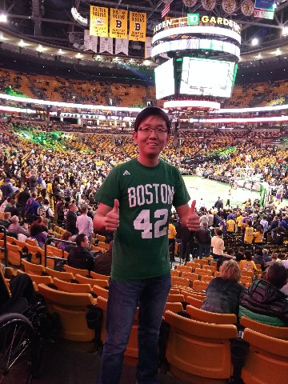

<!-- # Shuang Li -->

 
&nbsp;&nbsp;&nbsp;&nbsp;**Assistant Professor** 
&nbsp;&nbsp;&nbsp;&nbsp;[School of computing](http://cs.bit.edu.cn/) 
&nbsp;&nbsp;&nbsp;&nbsp;[Beijing Institute of Technology](http://bit.edu.cn/) 
&nbsp;&nbsp;&nbsp;&nbsp;[shuangli@bit.edu.cn](mailto:longmingsheng@gmail.com) 
&nbsp;&nbsp;&nbsp;&nbsp;Room 312, software building, Beijing Institute of Technology, Beijing, China 
&nbsp;&nbsp;&nbsp;&nbsp;<i>Reminder to prospective applicants: Opening master positions are available for class 2021</i> 

  

Research

- **Machine Learning**: Transfer Learning, Unsupervised Learning, Deep Learning

Education

- PhD, &nbsp;Tsinghua University
- B.E.,&nbsp; Northeastern University

Research Experience

- Intern, Microsoft Research Asia (MSRA), 11/2016 - 02/2017
- Visiting Scholar, Cornell University, 11/2015 - 06/2016

# Publication
---
1. **Prediction Reweighting for Domain Adaptation** 
**Shuang Li**, Shiji Song, Gao Huang,  
IEEE Transactions on Neural Networks and Learning Systems, 2017, 28(7): 1682-1695. SCI,( (IF : 6.108).

# Awards
---

# Students
---

Masters

- Binhui Xie (20119-2022):

Undergraduates

- Jinming Zhang (2016-2020): -> BIT Master

